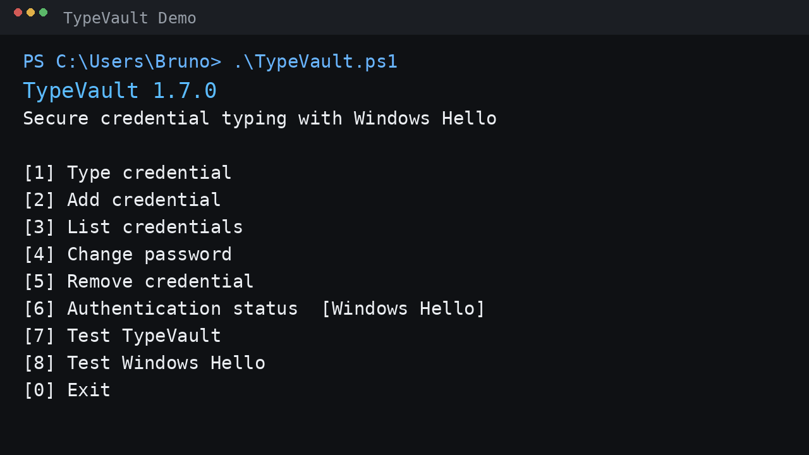
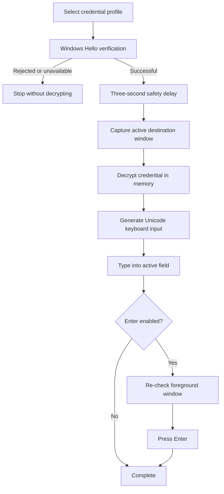

# TypeVault

<div align="center">

**Secure local credential storage and automated keyboard input for Windows using PowerShell 7.**

[](https://www.microsoft.com/windows)
[](https://learn.microsoft.com/powershell/)
[](https://www.python.org/)
[](LICENSE)
[](CHANGELOG.md)

A small, local-first utility for storing credentials with Windows DPAPI and typing them into the currently active field through Win32 `SendInput`.

</div>

## Demo

The animation below shows the intended TypeVault workflow. It uses simulated terminal output and does not contain a real credential.

<p align="center">
  
</p>

## Why TypeVault?

TypeVault was designed around a simple workflow: authenticate the user before releasing a stored credential, then type that credential into the field that the user has selected.

It deliberately avoids plain-text credential files and clipboard-based password transfer. The stored secret is protected with the current Windows user's DPAPI context and is only available in clear text in process memory for the short period required to generate keyboard input.

> TypeVault is a local automation utility. It is not a replacement for a full password manager, enterprise secrets platform, hardware security module, or endpoint security product.

## Key features

| Area | Implementation |
| --- | --- |
| Credential protection | Windows DPAPI, scoped to the current Windows user context |
| Authentication | Windows Hello required before every stored credential use |
| Verification methods | Windows selects the configured method, such as fingerprint or Windows Hello PIN |
| Keyboard input | Win32 `SendInput` with Unicode keyboard events |
| Clipboard | Not used for stored credentials |
| Plain-text storage | No plain-text password files |
| Targeting | Foreground window checks plus optional title/process filtering |
| Safety delay | Three seconds after successful authentication before typing |
| Enter key | Optional and guarded by a final foreground-window check |
| Launcher | Double-click `TypeVault.py` |
| Runtime data | `%LOCALAPPDATA%\\TypeVault` |
| Project isolation | Normal operation does not rewrite source files |
| Testing | Built-in self-test, Windows Hello test and Pester tests |

## How it works



The credential is intentionally not decrypted before successful Windows Hello verification and the required target-window checks.

## Requirements

- Windows 11, build 22000 or later.
- PowerShell 7.2 or newer.
- Python 3.10 or newer.
- A normal `.py` file association for double-click launching.
- Windows Hello configured for the Windows user when credential typing is required.

## Installation

Download or clone the repository, then open the project directory.

For a downloaded archive, Windows may attach `Zone.Identifier` metadata to extracted files. TypeVault's Python launcher removes that download block only when the metadata is actually present, so there is no need to run `Unblock-File` manually every time.

For the normal workflow, double-click:

```text
TypeVault.py
```

The launcher starts the main PowerShell implementation with an execution-policy bypass scoped to that child process. It does not modify the persistent PowerShell execution-policy configuration.

`TypeVault.cmd` remains available as a compatibility entry point.

## First run

Open `TypeVault.py`. The main menu provides:

```text
[1] Type credential
[2] Add credential
[3] List credentials
[4] Change password
[5] Remove credential
[6] Authentication status  [Windows Hello]
[7] Test TypeVault
[8] Test Windows Hello
[0] Exit
```

A typical credential-use sequence is:

1. Select **Type credential**.
2. Select the stored profile.
3. Complete Windows Hello with the configured method, such as fingerprint or PIN.
4. After successful authentication, TypeVault waits three seconds.
5. During the three-second window, place the cursor in the destination field.
6. TypeVault checks the foreground window and sends the credential through `SendInput`.
7. If Enter is enabled, TypeVault checks the foreground window again before pressing Enter.

No manual copy and paste is required.

## Credential storage

Runtime credential data is stored below:

```text
%LOCALAPPDATA%\\TypeVault\\Credentials
```

Password material is protected using Windows DPAPI under the current Windows user context.

The project directory is not used as runtime storage. The Python launcher also disables Python bytecode generation so normal execution does not create `__pycache__` or `.pyc` files.

## Windows Hello

Windows Hello is mandatory before every stored credential is decrypted for typing. There is no menu option to disable this requirement.

The TypeVault PowerShell 7 process uses a dedicated Windows PowerShell 5.1 helper for the desktop Windows Hello interoperability layer. This isolates the Windows Runtime interop from the main PowerShell 7 implementation.

The application receives the verification result. It does not receive biometric data or the Windows Hello PIN itself.

### Test Windows Hello

Use:

```text
[8] Test Windows Hello
```

This performs an interactive Windows Hello verification without reading, decrypting or typing any stored credential.

### Authentication status

Use:

```text
[6] Authentication status  [Windows Hello]
```

This checks whether the Windows Hello verification facility is available to the current Windows user. It does not intentionally trigger a biometric or PIN prompt.

## Command-line usage

Examples:

```powershell
.\\TypeVault.ps1 -Action Menu
.\\TypeVault.ps1 -Action Type
.\\TypeVault.ps1 -Action Type -Profile Work
.\\TypeVault.ps1 -Action Type -Profile Work -NoEnter
.\\TypeVault.ps1 -Action Type -Profile Work -WindowTitle '*Login*'
.\\TypeVault.ps1 -Action Type -Profile Work -WindowProcess '<process-name>'
.\\TypeVault.ps1 -Action Setup -Profile Work
.\\TypeVault.ps1 -Action List
.\\TypeVault.ps1 -Action Remove -Profile Work
.\\TypeVault.ps1 -Action Test
.\\TypeVault.ps1 -Action TestHello
```

When `-Profile` is omitted for `Type`, an interactive profile selector is displayed.

## Project structure

```text
TypeVault/
├── TypeVault.ps1
├── TypeVault.py
├── TypeVault.cmd
├── TypeVault-Type.cmd
├── TypeVault-Setup.cmd
├── tools/
│   ├── Invoke-Checks.ps1
│   ├── Watch-SourceTree.ps1
│   └── WindowsHello.ps1
├── Tests/
│   ├── TypeVault.Tests.ps1
│   ├── TypeVault.Authentication.Tests.ps1
│   └── TypeVault.Launcher.Tests.ps1
├── docs/
│   ├── USER-GUIDE.md
│   └── images/
│       └── typevault-demo.gif
├── SECURITY.md
├── SECURITY-AUDIT.md
├── CONTRIBUTING.md
├── AGENTS.md
├── CHANGELOG.md
└── LICENSE
```

## Testing

Run the repository checks from PowerShell 7 on Windows:

```powershell
.\\tools\\Invoke-Checks.ps1
```

Run Pester directly when installed:

```powershell
Invoke-Pester -Path .\\Tests
```

Run the application's built-in tests:

```powershell
.\\TypeVault.ps1 -Action Test
.\\TypeVault.ps1 -Action TestHello
```

Windows Hello functional verification is interactive and therefore must be tested on a Windows desktop where Windows Hello is configured.

## Security considerations

TypeVault reduces exposure created by storing passwords in plain-text files or moving them through the clipboard, but keyboard automation has inherent limitations.

The clear-text credential necessarily exists in process memory during the short typing operation. TypeVault does not intentionally write that value to files or logs and does not place it on the clipboard.

Synthetic keyboard input may be blocked by elevated processes, secure desktop controls, application-specific protections or Windows integrity-level restrictions. Successful Windows Hello authentication does not guarantee that a destination application will accept synthetic input.

DPAPI protects stored data according to the Windows user's cryptographic context. It is not intended to protect a fully compromised local account or endpoint.

See [SECURITY.md](SECURITY.md) and [SECURITY-AUDIT.md](SECURITY-AUDIT.md) for the detailed security model and known limitations.

## Documentation

- [User guide](docs/USER-GUIDE.md) for installation, interactive usage and troubleshooting.
- [Security policy](SECURITY.md) for security reporting and handling.
- [Security audit](SECURITY-AUDIT.md) for the addressed design findings and residual risks.
- [Contributing guide](CONTRIBUTING.md) for repository and development conventions.
- [Changelog](CHANGELOG.md) for release history.

## Current release

**v1.7.0** introduces the current authentication-first interaction model, with a three-second post-authentication delay before the destination field is captured and typed into. It also keeps Windows download-block handling automatic without requiring a manual `Unblock-File` command for each launch.

## Licence

MIT Licence. See [LICENSE](LICENSE).

---

<div align="center">

Built as a focused Windows automation project with PowerShell 7, Windows DPAPI, Win32 input and a small Python launcher.

</div>
